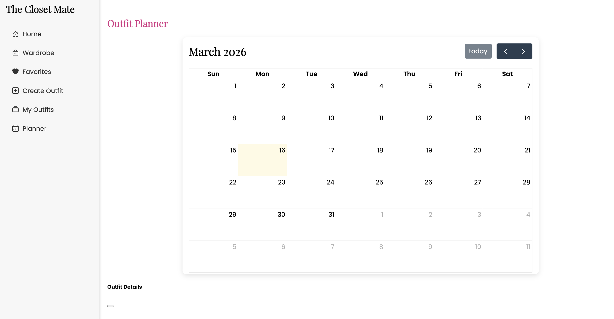

ClosetMate
ClosetMate is a wardrobe management web application that helps users organize their clothing and plan outfits more efficiently.

The application allows users to store clothing items in a digital wardrobe, create outfits by combining different pieces, and schedule outfits for specific days or future occasions.

Landing Page

  

Outfit Planner

  

Features
Add clothing items to a personal digital wardrobe
Mark clothing items as favorites
Create outfits by combining multiple clothing pieces
Plan outfits for specific days of the week
Schedule outfits for future occasions
Browse and manage clothing through a clean and simple interface

Technologies Used
C#
ASP.NET Razor Pages
Microsoft SQL Server
